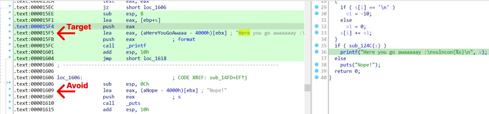
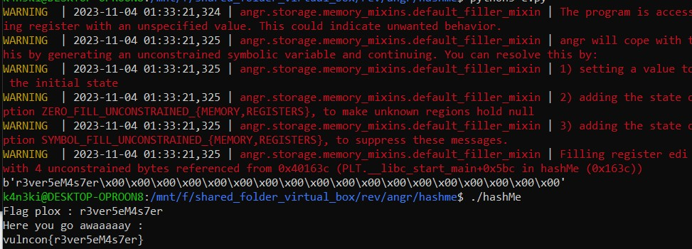

## HashMe(VULNCON CTF 2020)

## Challenge Description

I hash I xor what else can I do?

Flag format: vulncon{flag}

Download the Binary from [here](hashMe)




```python
import angr

p = angr.Project("hashMe")

state = p.factory.entry_state()
simgr = p.factory.simgr(state)

starting_address = p.loader.main_object.min_addr

target = starting_address + 0x15F5
avoid = starting_address + 0x1609

simgr.explore(find = target, avoid = avoid)

if simgr.found:
    target_state = simgr.found[0]
    print(target_state.posix.dumps(0))
else:
    print("[-] Could not find the soultion")

```


