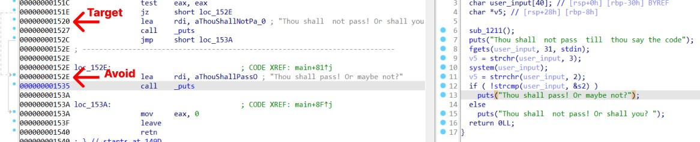
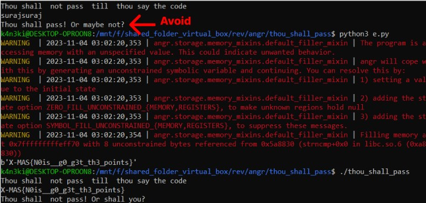

## thou shall pass?(X-MAS CTF 2020)

## Challenge Description

For thou to pass, the code might not but be entered

Author: Th3R4nd0m

Download the Binary from [here](thou_shall_pass)



```python
import angr

p = angr.Project("thou_shall_pass")

state = p.factory.entry_state()
simgr = p.factory.simgr(state)

base_address = p.loader.main_object.min_addr

avoid_addr = base_address + 0x152E
target_addr = base_address + 0x1520

simgr.explore(find = target_addr, avoid = avoid_addr)

if simgr.found:
    found_state = simgr.found[0]
    print(found_state.posix.dumps(0))
else:
    print("[-] Could not found the solution")
```


